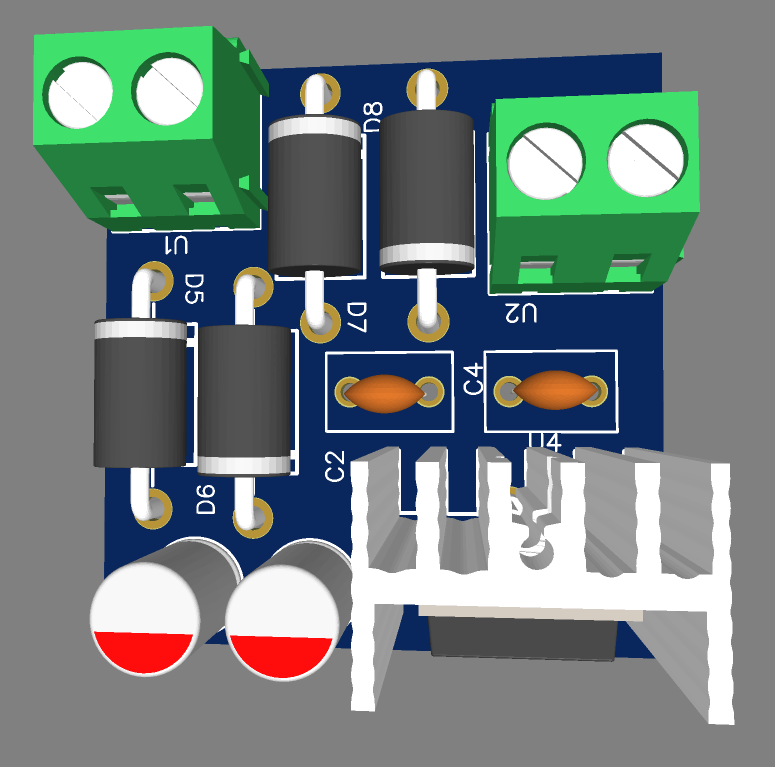

# 5V Linear Power Supply (LM7805)

A reliable, compact linear power supply unit (PSU) designed to step down and regulate alternating current (AC) to a stable **5V DC output** using the classic LM7805 voltage regulator. 

This repository contains the complete hardware design including schematics, Bill of Materials (BOM), and production-ready Gerber files.

## 📌 Features
* **Input:** Step-down AC voltage (Typically via a 9V-12V AC Transformer).
* **Output:** Clean, regulated 5V DC.
* **Rectification:** Full-bridge rectifier for smooth AC-to-DC conversion.
* **Filtering:** High-capacity ripple filtering and high-frequency noise decoupling capacitors.
* **Thermal Management:** Footprint accommodates a heatsink on the LM7805 for stable continuous loads.
* **Indicators:** Onboard LED for output status verification.

---

## 🛠️ Hardware Preview

---

## 📂 Repository Structure

* `Schematic_power_supply_7805.pdf` — Schematic diagram in PDF format.
* `BOM_power_supply_7805_...csv` — Complete Bill of Materials with component values and footprints.
* `Gerber_power_supply_7805_PCB_...zip` — Production-ready manufacturing files for the PCB.
* `SCH_...json` / `PCB_...json` — Source files for the circuit design.

---

## ⚡ How it Works

1. **Step Down:** A transformer drops the high-voltage mains AC down to a safer low-voltage AC.
2. **Rectification:** A bridge rectifier converts the low-voltage AC into a pulsating DC voltage.
3. **Filtering:** An electrolytic capacitor smooths out the pulsating DC ripple.
4. **Regulation:** The **LM7805 IC** clips the unregulated DC down to a rock-solid, constant 5V DC output.
5. **Decoupling:** A small ceramic capacitor at the output filters out any transient high-frequency noise.

---

## 📝 Bill of Materials (BOM) Highlights

| Component | Description | Quantity |
| --- | --- | --- |
| **IC1** | LM7805 Linear Voltage Regulator (TO-220) | 1 |
| **BR1** | Bridge Rectifier Bridge / 4x Rectifier Diodes | 1 |
| **C1** | Electrolytic Filter Capacitor (Input smoothing) | 1 |
| **C2** | Ceramic Decoupling Capacitor (Output filtering) | 1 |
| **LED1** | Power Indicator LED | 1 |
| **R1** | Current Limiting Resistor for LED | 1 |
| **CONN** | Input & Output Screw Terminals / Pins | 2 |

*Check the full `.csv` file in the repository for detailed component values and packages.*

---

## ⚠️ Safety Warning & Disclaimer
**High Voltage Hazard:** This project interfaces with Alternating Current (AC). Mains voltage (110V/230V) can be lethal if handled incorrectly. Always handle the primary side of transformers with extreme caution. Ensure the circuit is unplugged from the wall before modifying or touching any components. 

---

## 🚀 How to Manufacture
1. Download the latest `Gerber_*.zip` file from this repository.
2. Upload the zip file to any PCB manufacturing service (e.g., JLCPCB, PCBWay, OshPark).
3. Choose standard options (1.6mm thickness, FR4 material, etc.) and order.
4. Solder components according to the provided PDF schematic and BOM.

---

## 📄 License
This project is open-source. Feel free to use, modify, and distribute it for personal or educational purposes.
